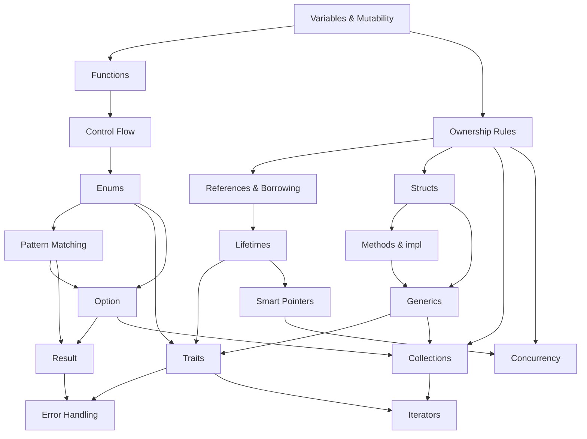

# Rust Concept Relationships

#concept-map #knowledge-graph #dependencies

> Understanding how Rust concepts build on each other

## 🗺️ The Big Picture



## 🏗️ Dependency Layers

### Layer 1: Foundation
**Core language features that everything builds on**

- **[[Variables]]** - Basic data storage
- **[[control#Functions]]** - Code organization
- **[[control#If]]** - Basic control flow

*Can learn independently - no prerequisites*

### Layer 2: Memory Management
**Rust's unique selling point**

- **[[ownership#Ownership Rules]]** ← Requires: Variables
- **[[ownership#Mutable vs Immutable References]]** ← Requires: Ownership
- **[[lifetimes]]** ← Requires: References, Ownership

*Sequential learning required - each builds on previous*

### Layer 3: Data Organization
**Structuring and organizing data**

- **[[ownership#Structs]]** ← Requires: Ownership, Functions
- **[[enums]]** ← Requires: Pattern matching concepts
- **[[control#Match]]** ← Requires: Control flow basics

*Can learn in parallel once Layer 1 is solid*

### Layer 4: Null Safety
**Handling optional and missing data**

- **[[option]]** ← Requires: Enums, Pattern matching
- **[[errors#Result<T,E> Enum]]** ← Requires: Enums, Pattern matching
- **[[errors#The `?` Operator]]** ← Requires: Result, Functions

*Linear dependency - must learn Option before Result*

### Layer 5: Generic Programming
**Code reuse and abstraction**

- **[[generics]]** ← Requires: Functions, Structs, Ownership
- **[[traits]]** ← Requires: Generics, Methods, Ownership
- **[[generics#Traits as Bounds]]** ← Requires: Both Generics and Traits

*Traits and Generics are tightly coupled - learn together*

### Layer 6: Collections & Data Structures
**Working with groups of data**

- **[[collections#Vectors]]** ← Requires: Ownership, Generics
- **[[collections#Strings]]** ← Requires: Ownership, References
- **[[collections#HashMaps]]** ← Requires: Ownership, Option, Generics

*All require solid ownership understanding*

## 🔗 Critical Relationships

### Strong Dependencies
*Cannot understand B without A*

- **[[ownership]]** → **[[lifetimes]]**
  Lifetimes are annotations for ownership rules

- **[[enums]]** → **[[option]]**
  Option is just an enum with special compiler support

- **[[option]]** → **[[errors]]**
  Result follows the same patterns as Option

- **[[generics]]** ↔ **[[traits]]**
  Tightly coupled - traits make generics useful

### Supporting Relationships
*A helps understand B, but B can exist without A*

- **[[control#Match]]** → **[[enums]]**
  Pattern matching makes enums powerful

- **[[ownership#Structs]]** → **[[traits]]**
  Traits are often implemented on structs

- **[[collections]]** ← **[[ownership]]** + **[[generics]]**
  Collections demonstrate these concepts in practice

### Common Confusion Points
*Topics often mixed up*

- **[[ownership#Borrowing vs Ownership]]**
  When to move vs when to borrow

- **[[option]]** vs **[[errors#Result<T,E> Enum]]**
  When to use each for error handling

- **[[generics]]** vs **[[traits]]**
  Type parameters vs behavior definitions

## 📚 Learning Prerequisites

### Before Studying Each Topic:

**[[ownership]]**
- ✅ Understand variables and mutability
- ✅ Know basic function syntax

**[[lifetimes]]**
- ✅ Master [[ownership]] rules
- ✅ Understand references vs values
- ✅ Comfortable with [[generics]] syntax

**[[enums]]**
- ✅ Know basic [[control#Match]] syntax
- ✅ Understand data organization with structs

**[[option]]**
- ✅ Master [[enums]] and pattern matching
- ✅ Understand [[control#Match]] exhaustiveness

**[[errors]]**
- ✅ Comfortable with [[option]] patterns
- ✅ Know [[control#Functions]] and return types
- ✅ Understand [[generics]] basics

**[[generics]]**
- ✅ Solid [[ownership]] understanding
- ✅ Know [[ownership#Structs]] and methods
- ✅ Basic [[control#Functions]] knowledge

**[[traits]]**
- ✅ Understand [[generics]] syntax
- ✅ Know [[ownership#Methods]] and `impl` blocks
- ✅ Comfortable with [[generics]] bounds

**[[collections]]**
- ✅ Master [[ownership]] and borrowing
- ✅ Understand [[option]] for HashMap lookups
- ✅ Know [[generics]] for type parameters

## 🎯 Optimal Learning Orders

### Memory-First Path
For systems programming focus:
**[[ownership]]** → **[[lifetimes]]** → **[[smart-pointers]]** → **[[concurrency]]**

### Types-First Path
For application development:
**[[ownership#Structs]]** → **[[enums]]** → **[[traits]]** → **[[generics]]**

### Safety-First Path
For error handling mastery:
**[[enums]]** → **[[option]]** → **[[errors]]** → **[[collections]]**

### Balanced Path (Recommended)
**[[ownership]]** → **[[enums]]** → **[[option]]** → **[[generics]]** → **[[traits]]** → **[[errors]]** → **[[lifetimes]]**

## 🧩 Integration Points

### Where Concepts Come Together:

**Collections + Ownership + Generics**
```rust
let mut map: HashMap<String, Vec<i32>> = HashMap::new();
//              ↑         ↑       ↑
//          ownership   generic  generic
```

**Traits + Generics + Lifetimes**
```rust
fn process<'a, T: Display + Debug>(item: &'a T) -> &'a str
//         ↑   ↑                            ↑      ↑
//      lifetime generic                lifetime lifetime
```

**Enums + Pattern Matching + Error Handling**
```rust
match result {
//  ↑
// Result<T,E> enum
    Ok(value) => process(value),
    Err(e) => handle_error(e),
//  ↑
// Pattern matching
}
```

## 🔄 Review Cycles

### Daily (5 min)
Review one concept relationship from the map above

### Weekly (15 min)
Trace through one integration point with code examples

### Before New Topics
Verify you understand all prerequisite relationships

---

*Use this map to identify gaps in understanding and plan your study sessions! 🗺️*
