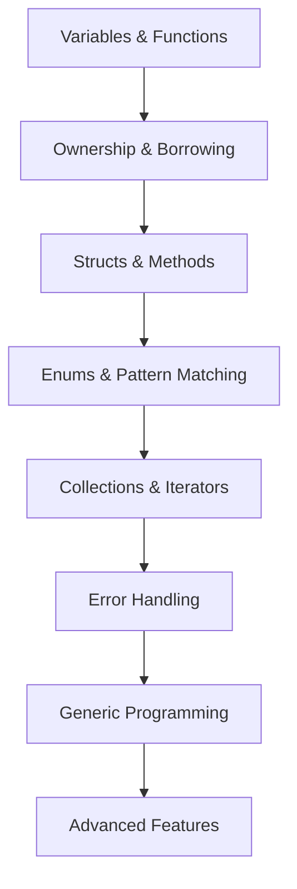

# Rust Learning Paths

#learning-paths #study-guides #obsidian-canvas

> Multiple ways to navigate your Rust knowledge based on your goals and time

## 🚀 Quick Reference Paths

### 5-Minute Memory Refresh
Perfect before coding sessions or interviews:

1. **[[ownership#Ownership Rules]]** - The three fundamental rules
2. **[[option#match]]** - Essential pattern matching
3. **[[errors#The `?` Operator]]** - Error propagation syntax
4. **[[traits#Traits as Parameters]]** - Basic generic programming

### 15-Minute Deep Dive
When you need to refresh a specific area:

#### Memory Management Track
**[[ownership]]** → **[[lifetimes]]** → **[[smart-pointers]]**
- Focus: How Rust manages memory safely
- Key concepts: Borrowing, lifetime annotations, shared ownership

#### Type System Track
**[[generics]]** → **[[traits]]** → **[[errors]]**
- Focus: Generic programming and abstractions
- Key concepts: Type parameters, trait bounds, error handling

#### Data Structures Track
**[[collections#Vectors]]** → **[[collections#HashMaps]]** → **[[option]]**
- Focus: Working with data effectively
- Key concepts: Ownership in collections, null safety

#### Pattern Matching Track
**[[enums]]** → **[[option]]** → **[[errors]]** → **[[control#Match]]**
- Focus: Handling different cases and states
- Key concepts: Exhaustive matching, destructuring

## 📚 Comprehensive Study Paths

### Foundation → Advanced (60 minutes)
*Complete review of core concepts*

**Study Order:**
1. **[[ownership]]** - Master the foundation (15 min)
2. **[[enums]]** + **[[option]]** - Learn pattern matching (10 min)
3. **[[errors]]** - Understand Result patterns (10 min)
4. **[[generics]]** + **[[traits]]** - Generic programming (15 min)
5. **[[lifetimes]]** - Advanced memory safety (10 min)

### Problem-Solving Focused (45 minutes)
*Practice-oriented review*

1. **Warm-up**: `exercises/00_review/review1.rs` (5 min)
2. **Core Concepts**: `exercises/00_review/review2.rs` (10 min)
3. **Error Handling**: `exercises/00_review/review3.rs` (15 min)
4. **Advanced Types**: `exercises/00_review/review4.rs` (15 min)

### Pre-Advanced Topics Preparation (30 minutes)
*Ready for lessons 17-23*

**Must Know:**
- [ ] Can explain [[ownership]] rules without reference
- [ ] Comfortable with [[enums]] pattern matching
- [ ] Understand [[traits]] and trait bounds
- [ ] Know when to use [[option]] vs [[errors#Result<T,E> Enum]]
- [ ] Can work with [[generics]] and lifetime annotations

**Checkpoint Exercise**: `exercises/00_review/integration1.rs`

## 🎯 Goal-Oriented Paths

### Interview Preparation
Focus on commonly tested concepts:

1. **Memory Safety**: [[ownership]] → [[lifetimes]]
2. **Type System**: [[generics]] → [[traits]]
3. **Error Handling**: [[option]] → [[errors]]
4. **Pattern Matching**: [[enums]] → [[control#Match]]

**Practice**: Complete all review exercises without hints

### Project Work
Real-world application development:

1. **Data Modeling**: [[ownership#Structs]] → [[enums]] → [[traits]]
2. **Error Handling**: [[errors]] → [[option]]
3. **Collections**: [[collections]] → iterators (lesson 18)
4. **Concurrency Prep**: [[ownership]] → smart pointers (lesson 19)

### Teaching Others
Deepen understanding by explaining:

1. **Start Simple**: [[ownership#Ownership Rules]] + examples
2. **Build Complexity**: [[enums]] → [[option]] → [[errors]]
3. **Show Power**: [[generics]] + [[traits]] combinations
4. **Advanced Topics**: [[lifetimes]] + real use cases

## 📅 Time-Based Study Plans

### Daily Review (10 minutes/day)
- **Monday**: [[ownership]] + [[lifetimes]]
- **Tuesday**: [[enums]] + [[option]]
- **Wednesday**: [[errors]] + error handling patterns
- **Thursday**: [[generics]] + [[traits]]
- **Friday**: [[collections]] + integration
- **Weekend**: Practice exercises

### Weekly Deep Dive (1 hour/week)
- **Week 1**: Foundation concepts (1-6)
- **Week 2**: Core concepts (7-12)
- **Week 3**: Advanced features (13-16)
- **Week 4**: Integration practice + prep for 17-23

### Before Continuing Rustlings
**Time needed**: 30-60 minutes

1. **Quick Check** (15 min): Review main concepts in [[rust-review-guide]]
2. **Practice** (30 min): Complete 2-3 review exercises
3. **Integration** (15 min): Try `integration1.rs`

✅ **Ready for Lesson 17+** when you can complete integration exercise without hints!

## 🧠 Learning Style Adaptations

### Visual Learners
- Use Obsidian **Graph View** to see concept connections
- Draw ownership diagrams while reading [[ownership]]
- Create mind maps for [[enums]] variants

### Hands-On Learners
- Start with exercises, refer to notes when stuck
- Modify existing code examples
- Build small projects using each concept

### Reading-Focused Learners
- Read through notes sequentially
- Take detailed written notes
- Create concept summaries

---

## 📖 Canvas Ideas for Obsidian

Create visual maps in Obsidian Canvas:

### Memory Management Canvas
- Central node: [[ownership]]
- Branches: [[lifetimes]], [[smart-pointers]], borrowing rules
- Color code: Green for safe, red for dangerous patterns

### Type System Canvas
- Flow from [[generics]] → [[traits]] → real examples
- Show how they work together in practice

### Error Handling Canvas
- Decision tree: [[option]] vs [[errors#Result<T,E> Enum]]
- Show propagation patterns with `?` operator

---

*Choose the path that matches your current needs and available time! 🚀*
