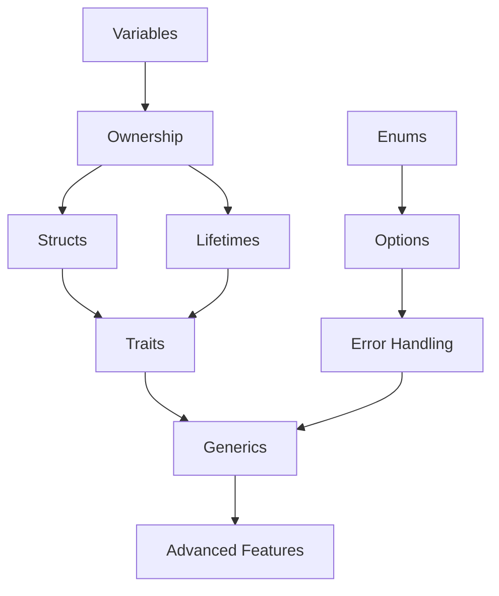

# Rust Learning Review Guide

> Your comprehensive review system for Rustlings lessons 1-16, with preparation for lessons 17-23

## 📊 Progress Dashboard

### ✅ Completed Lessons (1-16)
- [[#Foundation Phase|🟢 Foundation]] (1-6): Variables, Functions, Control Flow, Types, Vectors, Move Semantics
- [[#Core Concepts Phase|🟢 Core Concepts]] (7-12): Structs, Enums, Strings, Modules, HashMaps, Options
- [[#Advanced Features Phase|🟢 Advanced Features]] (13-16): Error Handling, Generics, Traits, Lifetimes

### 🔄 Current Lesson
- [[#Tests Phase|🟡 Tests]] (17): Unit testing, integration tests

### 📋 Remaining Lessons (18-23)
- [[#Remaining Topics|🔵 Advanced Topics]] (18-23): Iterators, Smart Pointers, Threads, Macros, Clippy, Conversions

---

## 🗺️ Learning Phases

### Foundation Phase
*Building blocks of Rust programming*

| Lesson | Topic                            | Key Concepts                                      | Review Notes                |
| ------ | -------------------------------- | ------------------------------------------------- | --------------------------- |
| 01     | [[Variables\|Variables]]         | `let`, `mut`, shadowing                           | [[ownership\|📖 Details]]   |
| 02     | [[control#Functions\|Functions]] | `fn`, parameters, return types                    | [[control\|📖 Details]]     |
| 03     | [[control#If\|Control Flow]]     | `if`, `match`, loops                              | [[control\|📖 Details]]     |
| 04     | **Primitive Types**              | integers, floats, booleans, chars, arrays, tuples | *See exercises*             |
| 05     | [[collections#Vectors\|Vectors]] | `Vec<T>`, push, pop, indexing                     | [[collections\|📖 Details]] |
| 06     | [[ownership\|Move Semantics]]    | ownership rules, borrowing, references            | [[ownership\|📖 Details]]   |

**🎯 Foundation Review Path**: [[variables]] → [[ownership]] → [[control]] → [[collections#Vectors]]

### Core Concepts Phase
*Organizing and structuring data*

| Lesson | Topic                              | Key Concepts                              | Review Notes                |
| ------ | ---------------------------------- | ----------------------------------------- | --------------------------- |
| 07     | [[ownership#Structs\|Structs]]     | struct definition, methods, `impl` blocks | [[ownership\|📖 Details]]   |
| 08     | [[enums\|Enums]]                   | enum variants, pattern matching           | [[enums\|📖 Details]]       |
| 09     | [[collections#Strings\|Strings]]   | `String` vs `&str`, manipulation          | [[collections\|📖 Details]] |
| 10     | **Modules**                        | `mod`, `pub`, `use`, crate organization   | *See exercises*             |
| 11     | [[collections#HashMaps\|HashMaps]] | key-value pairs, `entry()`, iteration     | [[collections\|📖 Details]] |
| 12     | [[option\|Options]]                | `Option<T>`, `Some`, `None`, unwrapping   | [[option\|📖 Details]]      |

**🎯 Core Concepts Review Path**: [[ownership#Structs]] → [[enums]] → [[option]] → [[collections]]

### Advanced Features Phase
*Generic programming and memory safety*

| Lesson | Topic | Key Concepts | Review Notes |
|--------|-------|-------------|--------------|
| 13 | [[errors\|Error Handling]] | `Result<T,E>`, `?` operator, propagation | [[errors\|📖 Details]] |
| 14 | [[generics\|Generics]] | generic functions, structs, trait bounds | [[generics\|📖 Details]] |
| 15 | [[traits\|Traits]] | trait definition, implementation, bounds | [[traits\|📖 Details]] |
| 16 | [[lifetimes\|Lifetimes]] | lifetime annotations, borrowing rules | [[lifetimes\|📖 Details]] |

**🎯 Advanced Review Path**: [[errors]] → [[generics]] → [[traits]] → [[lifetimes]]

### Tests Phase
*Current focus - testing and validation*

| Lesson | Topic | Key Concepts | Status |
|--------|-------|-------------|---------|
| 17 | **Tests** | `#[test]`, `assert!`, `cargo test` | 🟡 In Progress |

### Remaining Topics
*Advanced Rust features to learn*

| Lesson | Topic | Key Concepts | Preparation |
|--------|-------|-------------|-------------|
| 18 | **Iterators** | `Iterator` trait, `map()`, `filter()`, `collect()` | Review [[collections#iter().map(\|v\| => {}).collect()]] |
| 19 | **Smart Pointers** | `Box<T>`, `Rc<T>`, `Arc<T>`, `Cow<T>` | Strong [[ownership]] foundation needed |
| 20 | **Threads** | `thread::spawn`, message passing, shared state | Builds on [[ownership]] + Smart Pointers |
| 21 | **Macros** | macro definition, `macro_rules!` | Advanced topic |
| 22 | **Clippy** | linting, code quality, best practices | Code review tool |
| 23 | **Conversions** | `From`, `Into`, `TryFrom`, `TryInto` | Uses [[traits]] heavily |

---

## 🔄 Quick Review Paths

### 5-Minute Warm-up
1. [[ownership#Ownership Rules]] - The three rules
2. [[option#match]] - Pattern matching essentials
3. [[errors#The `?` Operator]] - Error propagation
4. [[traits#Traits as Parameters]] - Generic programming basics

### 15-Minute Deep Dive
1. **Memory Management**: [[ownership]] → [[lifetimes]]
2. **Type System**: [[generics]] → [[traits]]
3. **Error Handling**: [[option]] → [[errors]]
4. **Collections**: [[collections#Vectors]] → [[collections#HashMaps]]

### Pre-Lesson 17+ Checklist
- [ ] Can explain [[ownership]] rules without looking
- [ ] Comfortable with [[enums]] and pattern matching
- [ ] Understand [[traits]] and generic programming
- [ ] Know when to use [[option]] vs [[errors#Result<T,E> Enum]]

---

## 🧠 Concept Connections

**Key Relationships:**
- [[ownership]] is fundamental to [[lifetimes]] and smart pointers
- [[enums]] enable [[option]] and [[errors#Result<T,E> Enum]]
- [[traits]] and [[generics]] work together for generic programming
- [[collections]] use all previous concepts extensively

---

## 🎯 Practice Recommendations

### Before Continuing to Lesson 17:
1. **Quick Test**: Can you implement a simple struct with methods?
2. **Challenge**: Write a function that takes generic parameters with trait bounds
3. **Review**: Make sure error handling with `Result` feels natural

### Custom Practice Exercises:
- See `exercises/00_review/` for additional practice problems
- Each exercise tests multiple concepts together
- All exercises work with `rustlings run` and `rustlings hint`

---

## 📚 Study Resources

###  Notes:
- [[ownership]] - References, borrowing, move semantics
- [[control]] - If statements, loops, functions
- [[enums]] - Pattern matching, enum variants
- [[option]] - Handling optional values
- [[errors]] - Result type, error propagation
- [[generics]] - Generic programming, bounds
- [[traits]] - Interfaces and trait objects
- [[lifetimes]] - Memory safety, lifetime annotations
- [[collections]] - Vectors, strings, hashmaps

### External Resources:
- [Rust Book Chapter Mapping](github/rustlang/rustlings/exercises/README.md)
- [Rustlings Hints](https://github.com/rust-lang/rustlings)

---

*Use the Obsidian graph view to visualize connections between concepts! 🕸️*
